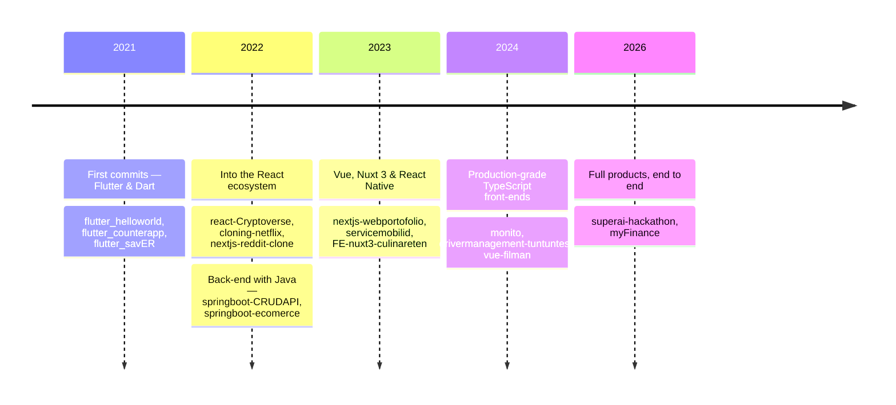

<div align="center">


<a href="https://imbeen.my.id">
  
</a>

<br/>

<a href="https://imbeen.my.id"></a>
<a href="mailto:bagus11nugroho@gmail.com"></a>
<a href="https://github.com/thebeen11?tab=followers"></a>


<br/>


</div>

##  &nbsp;whoami

```ts
const tomi: Developer = {
  name:      "Tomi Bagus Nugroho",
  alias:     "@thebeen11",
  role:      "Front-End Web Developer",
  based_in:  "Semarang, Indonesia 🇮🇩",
  studying:  "Universitas Negeri Semarang",
  web:       "https://imbeen.my.id",

  daily_drivers: ["Vue.js", "React.js", "TypeScript", "Tailwind CSS"],
  also_speaks:   ["Nuxt 3", "Next.js", "React Native", "Flutter", "Spring Boot"],

  currently: {
    building:  ["myFinance", "superai-hackathon"],
    learning:  "shipping full-stack products end to end",
    open_to:   "front-end roles & collaboration",
  },
};
```

<div align="center">

</div>

## 🧰 &nbsp;Toolbox

<div align="center">

**Front-End**


**Mobile**


**Back-End & Data**


**Tooling**


</div>

## 📊 &nbsp;The Numbers

<div align="center">


</div>

## 🚀 &nbsp;Featured Work

<div align="center">

<a href="https://github.com/thebeen11/superai-hackathon">
  
</a>
<a href="https://github.com/thebeen11/myFinance">
  
</a>

<a href="https://github.com/thebeen11/nextjs-webportofolio">
  
</a>
<a href="https://github.com/thebeen11/react-Cryptoverse">
  
</a>

</div>

<details>
<summary><b>📂 &nbsp;More things I've built</b></summary>

<br/>

| Project | What it is | Stack |
| :--- | :--- | :--- |
| [**FE-nuxt3-culinareten**](https://github.com/thebeen11/FE-nuxt3-culinareten) | Culinary discovery front-end | `Nuxt 3` `Vue` |
| [**culinareten**](https://github.com/thebeen11/culinareten) | Service layer for the culinary app | `Java` |
| [**drivermanagement-tuntuntest**](https://github.com/thebeen11/drivermanagement-tuntuntest) | Driver management dashboard | `TypeScript` |
| [**monito**](https://github.com/thebeen11/monito) | Pet marketplace UI | `Vue` |
| [**vue-filman**](https://github.com/thebeen11/vue-filman) | Movie browsing app | `Vue` |
| [**react-native-ups**](https://github.com/thebeen11/react-native-ups) | Cross-platform mobile app | `React Native` `TypeScript` |
| [**flutter_elearning**](https://github.com/thebeen11/flutter_elearning) | E-learning mobile experience | `Flutter` `Dart` |
| [**jenius-clone**](https://github.com/thebeen11/jenius-clone) | Banking landing page recreation | `HTML` `CSS` |
| [**nextjs-twitter-clone**](https://github.com/thebeen11/nextjs-twitter-clone) | Social feed clone | `Next.js` `TypeScript` |
| [**springboot-ecomerce**](https://github.com/thebeen11/springboot-ecomerce) | E-commerce REST API | `Java` `Spring Boot` |
| [**react-firebase**](https://github.com/thebeen11/react-firebase) | Realtime app on Firebase | `TypeScript` `Firebase` |
| [**backend-nodebookingapp**](https://github.com/thebeen11/backend-nodebookingapp) | Booking API | `Node.js` `Express` |

</details>

<details>
<summary><b>🧭 &nbsp;How I got here</b></summary>

<br/>



</details>

<div align="center">


## 🐍 &nbsp;Watch my contributions get eaten

<picture>
  <source media="(prefers-color-scheme: dark)" srcset="https://raw.githubusercontent.com/thebeen11/thebeen11/output/snake-dark.svg" />
  <source media="(prefers-color-scheme: light)" srcset="https://raw.githubusercontent.com/thebeen11/thebeen11/output/snake.svg" />
  
</picture>

<br/><br/>

### 💬 &nbsp;Let's build something

I'm always up for interesting front-end work, open-source collabs, or a good conversation about design systems.

<a href="mailto:bagus11nugroho@gmail.com"></a>
<a href="https://imbeen.my.id"></a>


</div>
